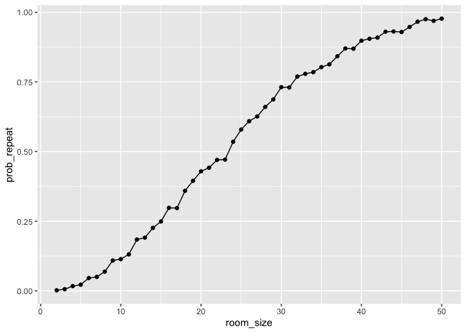
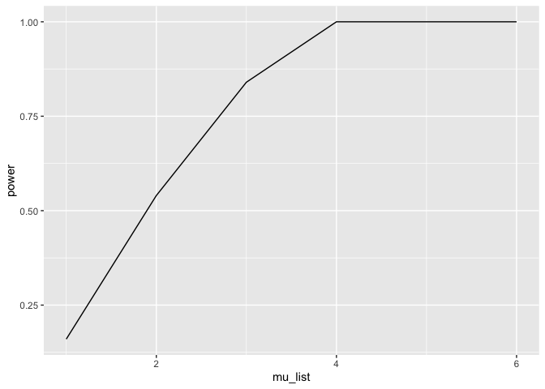
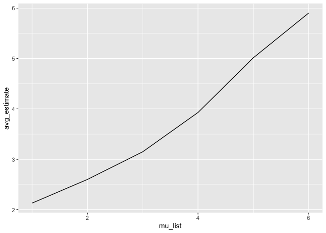

p8105_hw5_co2616
================
2025-11-14

``` r
library(tidyverse)
```

    ## ── Attaching core tidyverse packages ──────────────────────── tidyverse 2.0.0 ──
    ## ✔ dplyr     1.1.4     ✔ readr     2.1.5
    ## ✔ forcats   1.0.0     ✔ stringr   1.5.1
    ## ✔ ggplot2   3.5.2     ✔ tibble    3.3.0
    ## ✔ lubridate 1.9.4     ✔ tidyr     1.3.1
    ## ✔ purrr     1.1.0     
    ## ── Conflicts ────────────────────────────────────────── tidyverse_conflicts() ──
    ## ✖ dplyr::filter() masks stats::filter()
    ## ✖ dplyr::lag()    masks stats::lag()
    ## ℹ Use the conflicted package (<http://conflicted.r-lib.org/>) to force all conflicts to become errors

``` r
library(broom)
```

## Problem 1

creating a function where, for a fixed group size, randomly draws
“birthdays” for each person; checks whether there are duplicate
birthdays in the group; and returns TRUE or FALSE based on the result.

``` r
bday_sim = function (n_room) {
  
  birthdays = sample(1:365, n_room, replace = TRUE)

  repeated_bday = length(unique(birthdays)) < n_room

  repeated_bday
}
```

running this function 10000 times for each group size between 2 and 50
and computing the average

``` r
bday_sim_results = 
  expand_grid(
    room_size = 2:50,
  iter = 1:1000
  ) %>% 
  mutate(
    results = map_lgl(room_size, bday_sim)
  ) %>% 
  group_by(
    room_size
  ) %>% 
  summarise(
    prob_repeat = mean(results)
  )
```

plotting results

``` r
bday_sim_results %>% 
  ggplot(aes(x = room_size, y = prob_repeat)) +
  geom_point() +
  geom_line()
```

<!-- -->

As number of people in a room increases, there is a greater probability
that at least two people share a birthday. In a room full of about 25
people, there would be a 50% chance that at least two people share a
birthday. n a room full of about 50 people, there would be a 99% chance
that at least two people share a birthday.

## Problem 2

``` r
null_df = function(n, mu = 0, sigma = 5) {
  
 sim_df =
  tibble(
    x = rnorm(n = n, mean = mu, sd = sigma)
    )
 
 sim_df %>% 
    summarize(
       estimate = tidy(t.test(x))$estimate,
       p_val = tidy(t.test(x))$p.value
    ) 

}
```

``` r
sim_results_df = 
  expand_grid(
    sample_size = 30,
    iter = 1:5000
  ) |> 
  mutate(
    estimate_df = map(sample_size, null_df)
  ) |> 
  unnest(estimate_df)

sim_results_df
```

    ## # A tibble: 5,000 × 4
    ##    sample_size  iter estimate  p_val
    ##          <dbl> <int>    <dbl>  <dbl>
    ##  1          30     1   -0.145 0.869 
    ##  2          30     2    0.654 0.440 
    ##  3          30     3    0.216 0.810 
    ##  4          30     4    0.309 0.620 
    ##  5          30     5    1.31  0.163 
    ##  6          30     6   -1.32  0.0628
    ##  7          30     7    0.497 0.625 
    ##  8          30     8    0.613 0.507 
    ##  9          30     9    0.958 0.275 
    ## 10          30    10    0.729 0.498 
    ## # ℹ 4,990 more rows

``` r
new_null_df = function(n, mu, sigma = 5) {
  
 new_sim_df =
  tibble(
    x = rnorm(n = n, mean = mu, sd = sigma)
    )
 
 new_sim_df %>% 
    summarize(
       new_estimate = tidy(t.test(x))$estimate,
       new_p_val = tidy(t.test(x))$p.value
    ) 

}
```

**Repeat the above for 𝜇={1,2,3,4,5,6}, and complete the following:**

``` r
new_sim_results_df = 
  expand_grid(
    sample_size = 30,
    mu_list = c(1,2,3,4,5,6),
    iter = 1:50
  ) |> 
  mutate(
    new_estimate_df = map2(sample_size, mu_list, new_null_df)
  ) |> 
  unnest(new_estimate_df)

new_sim_results_df
```

    ## # A tibble: 300 × 5
    ##    sample_size mu_list  iter new_estimate new_p_val
    ##          <dbl>   <dbl> <int>        <dbl>     <dbl>
    ##  1          30       1     1        0.273    0.756 
    ##  2          30       1     2        0.450    0.660 
    ##  3          30       1     3        0.342    0.736 
    ##  4          30       1     4        1.40     0.0918
    ##  5          30       1     5       -0.588    0.450 
    ##  6          30       1     6        0.505    0.589 
    ##  7          30       1     7        1.43     0.123 
    ##  8          30       1     8       -0.311    0.761 
    ##  9          30       1     9        0.559    0.569 
    ## 10          30       1    10        0.772    0.334 
    ## # ℹ 290 more rows

``` r
new_sim_results_df %>%
  group_by(mu_list) %>%
  summarize(
    power = mean(new_p_val < 0.05)
  ) %>% 
  ggplot(aes(x = mu_list, y = power)) +
  geom_line()
```

<!-- -->

As effect size increases, the power increases and when the true mean is
4, you have reached max power.

``` r
new_sim_results_df %>%
  group_by(mu_list) %>%
  filter(new_p_val < 0.05) %>% 
  summarize(
    avg_estimate = mean(new_estimate)
  ) %>% 
  ggplot(aes(x = mu_list, y = avg_estimate)) +
  geom_line()
```

<!-- -->

Yes, as the effect size increase, the sample average of 𝜇̂ across tests
for which the null is rejected approximately equal to the true value of
𝜇 because power increases.

## Problem 3
