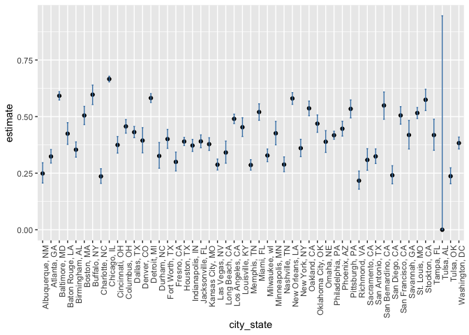

p8105_hw5_co2616
================
2025-11-14

loading key packages

``` r
library(tidyverse)
```

    ## ── Attaching core tidyverse packages ──────────────────────── tidyverse 2.0.0 ──
    ## ✔ dplyr     1.1.4     ✔ readr     2.1.5
    ## ✔ forcats   1.0.0     ✔ stringr   1.5.1
    ## ✔ ggplot2   3.5.2     ✔ tibble    3.3.0
    ## ✔ lubridate 1.9.4     ✔ tidyr     1.3.1
    ## ✔ purrr     1.1.0     
    ## ── Conflicts ────────────────────────────────────────── tidyverse_conflicts() ──
    ## ✖ dplyr::filter() masks stats::filter()
    ## ✖ dplyr::lag()    masks stats::lag()
    ## ℹ Use the conflicted package (<http://conflicted.r-lib.org/>) to force all conflicts to become errors

``` r
library(broom)
library(httr)
```

## Problem 1

creating a function where, for a fixed group size, randomly draws
“birthdays” for each person; checks whether there are duplicate
birthdays in the group; and returns TRUE or FALSE based on the result.

``` r
bday_sim = function (n_room) {
  
  birthdays = sample(1:365, n_room, replace = TRUE)

  repeated_bday = length(unique(birthdays)) < n_room

  repeated_bday
}
```

running this function 10000 times for each group size between 2 and 50
and computing the probability that at least two people in the group will
share a birthday

``` r
bday_sim_results = 
  expand_grid(
    group_size = 2:50,
    iter = 1:1000
  ) %>% 
  mutate(
    results = map_lgl(group_size, bday_sim)
  ) %>% 
  group_by(
    group_size
  ) %>% 
  summarise(
    prob_repeat = mean(results)
  )
```

plotting results

``` r
bday_sim_results %>% 
  ggplot(aes(x = group_size, y = prob_repeat)) +
  geom_point() +
  geom_line()
```

<!-- -->

As number of people in a room increases, there is a greater probability
that at least two people share a birthday. In a room full of about 22
people, there would be around a 50% chance that at least two people
share a birthday and in a room full of about 50 people, there would be
about a 99% chance that at least two people share a birthday.

## Problem 2

``` r
null_df = function(n, mu = 0, sigma = 5) {
  
 sim_df =
  tibble(
    x = rnorm(n = n, mean = mu, sd = sigma)
    )

 sim_df %>% 
    summarize(
       estimate = pull(tidy(t.test(x)), estimate),
       p_val = pull(tidy(t.test(x)), p.value)
    ) 
}
```

``` r
sim_results_df = 
  expand_grid(
    sample_size = 30,
    iter = 1:5000
  ) %>%  
  mutate(
    estimate_df = map(sample_size, null_df)
  ) %>%  
  unnest(estimate_df)
```

``` r
new_null_df = function(n, mu, sigma = 5) {
  
 new_sim_df =
  tibble(
    x = rnorm(n = n, mean = mu, sd = sigma)
    )
 
 new_sim_df %>% 
    summarize(
       new_estimate = pull(tidy(t.test(x)), estimate),
       new_p_val = pull(tidy(t.test(x)), p.value)
    ) 

}
```

**Repeating the above for 𝜇={1,2,3,4,5,6}**

``` r
new_sim_results_df = 
  expand_grid(
    sample_size = 30,
    mu_list = c(1,2,3,4,5,6),
    iter = 1:5000
  ) %>%  
  mutate(
    new_estimate_df = map2(sample_size, mu_list, new_null_df)
  ) %>%  
  unnest(new_estimate_df)

new_sim_results_df
```

    ## # A tibble: 30,000 × 5
    ##    sample_size mu_list  iter new_estimate new_p_val
    ##          <dbl>   <dbl> <int>        <dbl>     <dbl>
    ##  1          30       1     1       0.757     0.451 
    ##  2          30       1     2       1.03      0.363 
    ##  3          30       1     3       1.24      0.261 
    ##  4          30       1     4       1.12      0.301 
    ##  5          30       1     5       0.462     0.618 
    ##  6          30       1     6       1.04      0.256 
    ##  7          30       1     7       1.26      0.221 
    ##  8          30       1     8       0.992     0.269 
    ##  9          30       1     9       0.0119    0.989 
    ## 10          30       1    10       1.69      0.0409
    ## # ℹ 29,990 more rows

``` r
new_sim_results_df %>%
  group_by(mu_list) %>%
  summarize(
    power = mean(new_p_val < 0.05)
  ) %>% 
  ggplot(aes(x = mu_list, y = power)) +
  geom_line()
```

<!-- -->

As effect size increases, the power increases and when the true mean is
4, you have reached max power.

``` r
new_sim_results_df %>%
  group_by(mu_list) %>%
  filter(new_p_val < 0.05) %>% 
  summarize(
    avg_estimate = mean(new_estimate)
  ) %>% 
  ggplot(aes(x = mu_list, y = avg_estimate)) +
  geom_line()
```

<!-- -->

Overall the no; however, as the effect size increases, the sample
average of 𝜇̂ across tests for which the null is rejected approximately
is equal to the true value of 𝜇 because power increases.

## Problem 3

``` r
homicide_df = 
  read_csv("data/homicide-data.csv", na = c("NA", ".", "")) %>% 
  janitor::clean_names() %>% 
  unite("city_state", city, state, sep = ", " ) %>% 
  group_by(city_state) %>% 
  summarise(
    total_homicides = n(),
    unsol_homicides = sum(disposition %in% c("Close without arrest", "Open/No arrest"))
    )
```

    ## Rows: 52179 Columns: 12
    ## ── Column specification ────────────────────────────────────────────────────────
    ## Delimiter: ","
    ## chr (9): uid, victim_last, victim_first, victim_race, victim_age, victim_sex...
    ## dbl (3): reported_date, lat, lon
    ## 
    ## ℹ Use `spec()` to retrieve the full column specification for this data.
    ## ℹ Specify the column types or set `show_col_types = FALSE` to quiet this message.

The `homicide_df` dataset has 51 observations and 3 variables and it
shows the number of homicides across 50 large U.S. cities. This dataset
contains key variables such as `victim_age` which shows the age of the
victim of the homicide, `city` which shows the city in which the
homicide occurred, and `dispostion` which tells us the outcome of the
homicide.

``` r
baltimore = 
  homicide_df %>%
  filter(city_state == "Baltimore, MD")

baltimore_test = 
  prop.test(baltimore$unsol_homicides, baltimore$total_homicides)

baltimore_test %>% 
  broom::tidy() %>% 
  select(estimate, conf.low, conf.high)
```

    ## # A tibble: 1 × 3
    ##   estimate conf.low conf.high
    ##      <dbl>    <dbl>     <dbl>
    ## 1    0.592    0.573     0.610

``` r
city_test = function(x, n) {
  
  prop.test(x = x, n = n)

}
```

``` r
homicide_df_results = 
  homicide_df %>% 
  mutate(
    data = map2(unsol_homicides, total_homicides, city_test),
    results = map(data, broom::tidy)
  ) %>% 
  select(city_state, results) %>% 
  unnest(results) %>% 
  select(city_state, estimate, conf.low, conf.high)
```

    ## Warning: There was 1 warning in `mutate()`.
    ## ℹ In argument: `data = map2(unsol_homicides, total_homicides, city_test)`.
    ## Caused by warning in `prop.test()`:
    ## ! Chi-squared approximation may be incorrect

``` r
homicide_df_results
```

    ## # A tibble: 51 × 4
    ##    city_state      estimate conf.low conf.high
    ##    <chr>              <dbl>    <dbl>     <dbl>
    ##  1 Albuquerque, NM    0.249    0.207     0.296
    ##  2 Atlanta, GA        0.324    0.295     0.354
    ##  3 Baltimore, MD      0.592    0.573     0.610
    ##  4 Baton Rouge, LA    0.425    0.377     0.473
    ##  5 Birmingham, AL     0.354    0.321     0.388
    ##  6 Boston, MA         0.505    0.465     0.545
    ##  7 Buffalo, NY        0.597    0.553     0.639
    ##  8 Charlotte, NC      0.236    0.205     0.270
    ##  9 Chicago, IL        0.666    0.653     0.678
    ## 10 Cincinnati, OH     0.375    0.339     0.412
    ## # ℹ 41 more rows

``` r
homicide_df_results %>%
  mutate(
    city_sate = fct_reorder(city_state, estimate)
  ) %>% 
  ggplot(aes(x = city_state, y = estimate)) +
  geom_point() +
  geom_errorbar(aes(ymin = conf.low, ymax = conf.high), width = 0.2, color = "steelblue") +
  theme(axis.text.x = element_text(angle = 90, hjust = 1, vjust = 1))
```

<!-- -->
